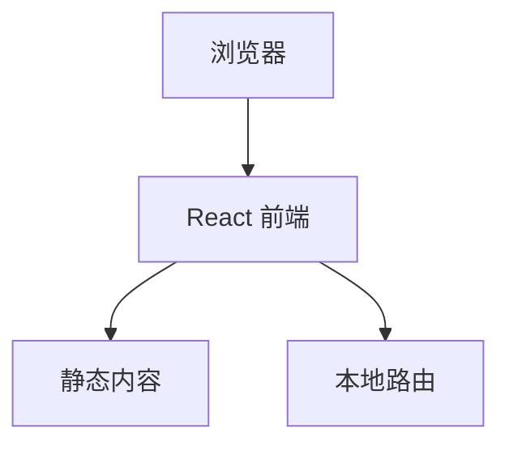

## 1. Architecture Design
这是一个纯前端静态网站，使用 React + TypeScript + Vite 构建，所有内容都在前端渲染，便于部署到 GitHub Pages。



## 2. Technology Description
- 前端：React@18 + TypeScript + tailwindcss@3 + Vite
- 初始化工具：vite-init
- 后端：无（纯静态网站）
- 部署：GitHub Pages

## 3. Route Definitions
| Route | Purpose |
|-------|---------|
| / | 首页，展示分类和精选题目 |
| /category/:id | 分类页面，展示该分类的所有题目 |
| /question/:id | 详情页面，展示题目和答案 |

## 4. Data Structure
### 4.1 面试题数据结构
```typescript
interface Question {
  id: string;
  title: string;
  content: string;
  category: string;
  difficulty: 'easy' | 'medium' | 'hard';
  answer: string;
  codeExample?: string;
  tags: string[];
}
```

### 4.2 分类数据结构
```typescript
interface Category {
  id: string;
  name: string;
  icon: string;
  color: string;
  description: string;
}
```
