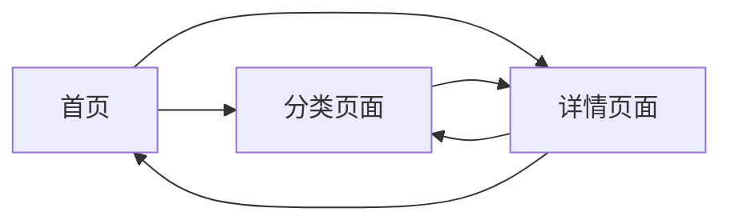

## 1. Product Overview
Java面试题网站是一个提供精选Java面试题和答案的静态网站，帮助开发者准备Java技术面试。
- 目标用户：Java开发者、求职者、学习者
- 价值：提供高质量的面试题资源，助力面试准备

## 2. Core Features

### 2.2 Feature Module
1. **首页**：英雄区域、导航栏、面试题分类列表
2. **面试题详情页**：题目展示、答案解析、相关题目推荐
3. **分类页面**：按类别展示面试题列表

### 2.3 Page Details
| Page Name | Module Name | Feature description |
|-----------|-------------|---------------------|
| 首页 | 英雄区域 | 展示网站标语和主要目的 |
| 首页 | 分类导航 | 快速访问不同类别的面试题 |
| 首页 | 精选题目 | 展示精选的热门面试题 |
| 详情页 | 题目展示 | 清晰展示面试题内容 |
| 详情页 | 答案解析 | 展开/收起答案，提供详细解析 |
| 详情页 | 相关题目 | 展示同类型的相关题目 |
| 分类页 | 题目列表 | 按分类展示所有面试题 |

## 3. Core Process
用户访问网站 → 浏览首页或选择分类 → 点击面试题 → 查看题目和答案 → 返回继续浏览其他题目

## 4. User Interface Design
### 4.1 Design Style
- 主色调：深蓝色（#1e3a8a）和天蓝色（#3b82f6）
- 辅助色：白色、浅灰色
- 按钮风格：圆角、渐变、悬停效果
- 字体：使用现代无衬线字体，标题使用有特色的字体
- 布局风格：卡片式布局，清晰的视觉层次
- 图标：使用简洁的线性图标

### 4.2 Page Design Overview
| Page Name | Module Name | UI Elements |
|-----------|-------------|-------------|
| 首页 | 英雄区域 | 渐变背景、大标题、副标题、CTA按钮 |
| 首页 | 分类导航 | 彩色卡片、图标、分类名称 |
| 首页 | 精选题目 | 卡片列表、题目预览、标签 |
| 详情页 | 题目展示 | 标题卡片、题目内容、难度标签 |
| 详情页 | 答案解析 | 可折叠区域、代码高亮、详细说明 |
| 详情页 | 相关题目 | 横向卡片列表、快速跳转 |
| 分类页 | 题目列表 | 垂直卡片、筛选功能、分页 |

### 4.3 Responsiveness
- 桌面端优先设计
- 移动端自适应布局
- 触摸友好的交互元素
